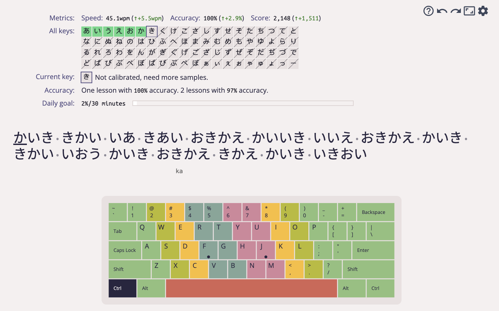
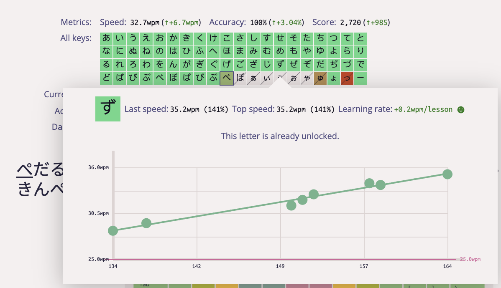

# kanabr

<p align="center">
    
</p>

kanabr is a typing tutor focused on **Japanese kana** (hiragana + katakana),
powered by an adaptive lesson engine: it tracks per-key statistics, generates
practice text that targets your weakest keys, and visualizes long‑term
progress.

<p align="center">
    
</p>

## Static-first (recommended)

This repo is designed to run as a **static SPA**: **no server required, no
cloud database required**. You can deploy it to Vercel / GitHub Pages / any
static hosting.

In static mode, user progress is stored locally in the browser
(IndexedDB / localStorage). That means:
- Switching browsers/devices (or clearing site data) loses progress unless you export it
- Server-backed features are unavailable (accounts/login, public profiles, high scores, multiplayer)

> If you need server features, you can still run server mode (see below).

## Quick start (static mode)

```bash
npm install
```

Build the static output (written to `vercel-dist/`):

```bash
npm run build-vercel
```

Preview locally (pick one):

```bash
npx serve -s vercel-dist
# or
python3 -m http.server 3000 -d vercel-dist
```

Then open the URL shown in your terminal.

## Deploy to Vercel (static mode)

Recommended Vercel settings:
- Build Command: `npm run build-vercel`
- Output Directory: `vercel-dist`

Optional build-time env vars:
- `KEYBR_BASE_URL` (default: `http://localhost:3000/`)
- `KEYBR_LOCALE` (default: `en`)
- `KEYBR_COLOR` (default: `system`)
- `KEYBR_FONT` (default: `open-sans`)

## Local data import/export

In static mode, go to **Profile**:
- **Export data**: exports local data (history + settings + preferences + theme) to `kanabr-local-data.json`
- **Import data**: imports a JSON file and overwrites current local data (supports `kanabr-local-data.json`, legacy `keybr-local-data.json`, and legacy `typing-data.json`)
- **Reset local data**: clears all local data and resets to defaults

## Japanese kana (romaji input) mode

1. Open the Practice page and click the settings button (gear icon).
2. Go to **Keyboard**:
   - `Language` → **Japanese**
   - `Layout` → **Japanese Romaji** (layout id: `ja-romaji`)
3. Go to **Lessons** (Guided lesson):
   - Optional: enable **Balance kana frequency**
   - Optional: adjust **Katakana ratio** (set to `0` for hiragana-only)
4. (Optional) In **Keyboard**, toggle **Show romaji helper** if you want to see
   suggested romaji spellings for the next kana.

## Development (optional)

Development build (webpack, `NODE_ENV=development`):

```bash
npm run build-dev
```

Watch mode:

```bash
npm run watch
```

## Server mode (optional)

If you want accounts/login, public profiles, high scores, or multiplayer, you
need to run the server.

The easiest setup uses sqlite (no MySQL required):

```bash
cp .env.example .env
npm start
```

> `.env.example` defaults to `DATABASE_CLIENT=sqlite` and uses `DATABASE_FILENAME`.

## Tests

```bash
npm run test
```

## Contributing

- Bugs / features: issues and PRs are welcome
- Translations: see `docs/translations.md`

## Acknowledgements

kanabr is based on the original keybr.com project by aradzie:
`https://github.com/aradzie/keybr.com`.

## License

Released under the GNU Affero General Public License v3.0.
